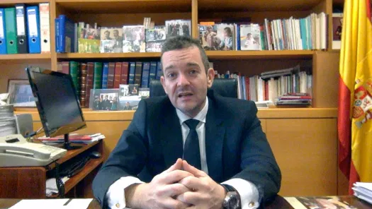

This is Paco.

*Dr. Francisco Rabadán Pérez (2016).*

## Presentación
Francisco Rabadán Pérez es profesor visitante en la URJC. Doctor *"cum laude en Estadística e Investigación Operativa"* por la **Universidad San Pablo CEU**. 

Licenciado en Administración y Dirección de Empresas. 

Actualmente está realizando diversas investigaciones entorno a la evolución del paradigma económico aplicando metodología cuantitativa. Es el organizador de las Jornadas Internacionales sobre Paradigma Económico Emergente – PARAECOM – URJC.

## Presentation
Francisco Rabadán Pérez is a visiting professor at the URJC. It is Doctor *"cum laude"* in Statistics and Operational Research from the **University San Pablo CEU**. 

Bachelor of Business Administration (Marketing) from the same university. 

Is currently conducting research on the evolution of the economic paradigm by applying quantitative methodology. It is the organizer of the URJC Emerging Economic Paradigm – PARAECOM – URJC.

### RESEARCH ID: F-4338-2016

<http://www.researcherid.com/rid/F-4338-2016>

### ORCID : 0000-0002-4324-7244

<http://orcid.org/0000-0002-4324-7244>

